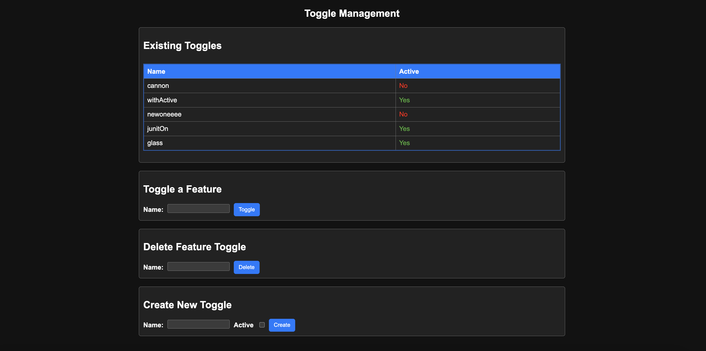

# toggle-service
A Java toggle service using Redis to store Feature toggles, toggle them, and delete them.

Uses Thymeleaf in order to display a basic UI that the user can interact with as shown below: 

